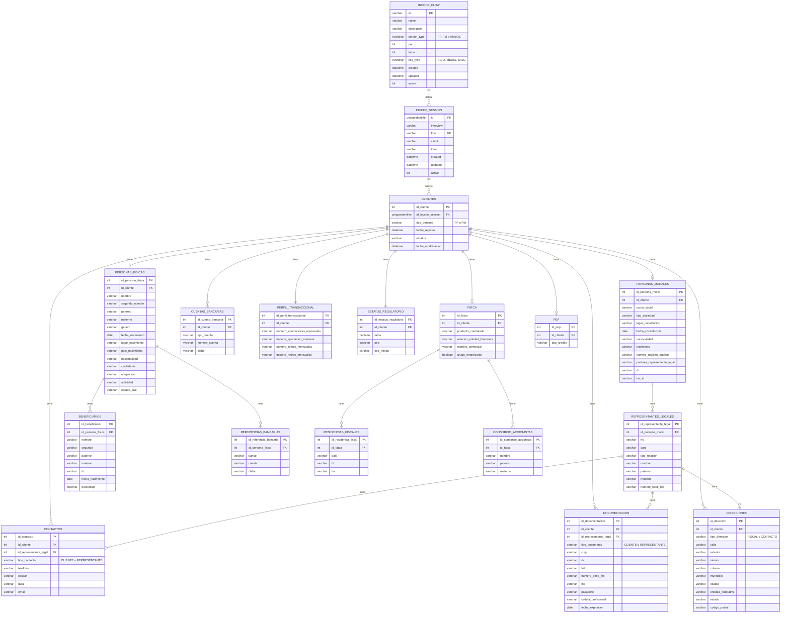

# Modelo de Base de Datos - Sistema Biométrico

## Análisis de Entidades

Basado en los archivos `pf.json` (Persona Física) y `pm.json` (Persona Moral), se identifican las siguientes entidades principales:

### Entidades Principales

#### Módulo INCODE (Sesiones Biométricas)
1. **INCODE_FLOW** - Catálogo de flujos biométricos disponibles
2. **INCODE_SESSION** - Sesiones de verificación biométrica

#### Módulo de Clientes y Datos
3. **CLIENTES** - Tabla principal que almacena información común
4. **PERSONAS_FISICAS** - Información específica de personas físicas
5. **PERSONAS_MORALES** - Información específica de personas morales
6. **DIRECCIONES** - Direcciones fiscales y de contacto
7. **CONTACTOS** - Información de contacto
8. **CUENTAS_BANCARIAS** - Información bancaria
9. **DOCUMENTACION** - Documentos de identificación
10. **REPRESENTANTES_LEGALES** - Representantes de personas morales
11. **BENEFICIARIOS** - Beneficiarios de personas físicas
12. **REFERENCIAS_BANCARIAS** - Referencias bancarias
13. **PERFIL_TRANSACCIONAL** - Información transaccional
14. **ESTATUS_REGULATORIO** - Información de cumplimiento
15. **FATCA** - Información FATCA
16. **PEP** - Información de personas políticamente expuestas
17. **RESIDENCIAS_FISCALES** - Residencias fiscales para FATCA
18. **CONSORCIO_ACCIONISTAS** - Accionistas para personas morales

## Diagrama Relacional



## Estructura de Tablas SQL

### Módulo INCODE - Gestión de Sesiones Biométricas

#### Tabla: INCODE_FLOW
```sql
CREATE TABLE [bio].[INCODE_FLOW] (
     [ID]          VARCHAR(50)  NOT NULL
    ,[NAME]        VARCHAR(50)  NOT NULL
    ,[DESCRIPTION] VARCHAR(250) NOT NULL
    ,[PERSON_TYPE] NVARCHAR(10) CHECK ([PERSON_TYPE] IN ('PF', 'PM', 'AMBOS'))
    ,[PEP]         BIT          NOT NULL CONSTRAINT [DF_INCODE_FLOW_PEP]     DEFAULT 0
    ,[FATCA]       BIT          NOT NULL CONSTRAINT [DF_INCODE_FLOW_FATCA]   DEFAULT 0
    ,[RISK_TYPE]   NVARCHAR(15) CHECK ([RISK_TYPE] IN ('ALTO', 'MEDIO', 'BAJO'))
    ,[CREATED]     DATETIME     NOT NULL CONSTRAINT [DF_INCODE_FLOW_CREATED] DEFAULT GETDATE()
    ,[UPDATED]     DATETIME
    ,[ACTIVE]      BIT          NOT NULL CONSTRAINT [DF_INCODE_FLOW_ACTIVE] DEFAULT 1

    ,CONSTRAINT [PK_INCODE_FLOW_ID]   PRIMARY KEY ([ID])
    ,CONSTRAINT [UQ_INCODE_FLOW_NAME] UNIQUE ([NAME])
);
```

#### Tabla: INCODE_SESSION
```sql
CREATE TABLE [bio].[INCODE_SESSION] (
     [ID]         UNIQUEIDENTIFIER
    ,[INTERVIEW]  VARCHAR(50)  NOT NULL
    ,[FLOW]       VARCHAR(50)  NOT NULL
    ,[CLIENT]     VARCHAR(25)  NOT NULL
    ,[TOKEN]      VARCHAR(500) NOT NULL
    ,[CREATED]    DATETIME     NOT NULL CONSTRAINT [DF_INCODE_SESSION_CREATED] DEFAULT GETDATE()
    ,[UPDATED]    DATETIME
    ,[ACTIVE]     BIT          NOT NULL CONSTRAINT [DF_INCODE_SESSION_ACTIVE] DEFAULT 1

    ,CONSTRAINT [PK_INCODE_SESSION_ID]        PRIMARY KEY ([ID])
    ,CONSTRAINT [FK_INCODE_SESSION_FLOW]      FOREIGN KEY ([FLOW]) REFERENCES [bio].[INCODE_FLOW] ([ID])
    ,CONSTRAINT [UQ_INCODE_SESSION_INTERVIEW] UNIQUE      ([INTERVIEW])
);
```

### Módulo de Datos de Clientes

### Tabla Principal: CLIENTES
```sql
CREATE TABLE [bio].[CLIENTES] (
    id_cliente INT IDENTITY(1,1) PRIMARY KEY,
    id_incode_session UNIQUEIDENTIFIER,
    tipo_persona VARCHAR(2) NOT NULL CHECK (tipo_persona IN ('PF', 'PM')),
    fecha_registro DATETIME DEFAULT GETDATE(),
    estatus VARCHAR(20) DEFAULT 'ACTIVO',
    fecha_modificacion DATETIME DEFAULT GETDATE(),
    FOREIGN KEY (id_incode_session) REFERENCES [bio].[INCODE_SESSION] ([ID])
);
```

### Tabla: PERSONAS_FISICAS
```sql
CREATE TABLE PERSONAS_FISICAS (
    id_persona_fisica INT IDENTITY(1,1) PRIMARY KEY,
    id_cliente INT NOT NULL,
    nombre VARCHAR(100) NOT NULL,
    segundo_nombre VARCHAR(100),
    paterno VARCHAR(100) NOT NULL,
    materno VARCHAR(100),
    genero VARCHAR(20),
    fecha_nacimiento DATE,
    lugar_nacimiento VARCHAR(200),
    pais_nacimiento VARCHAR(100),
    nacionalidad VARCHAR(100),
    ciudadania VARCHAR(100),
    ocupacion VARCHAR(200),
    actividad VARCHAR(200),
    estado_civil VARCHAR(50),
    FOREIGN KEY (id_cliente) REFERENCES CLIENTES(id_cliente)
);
```

### Tabla: PERSONAS_MORALES
```sql
CREATE TABLE PERSONAS_MORALES (
    id_persona_moral INT IDENTITY(1,1) PRIMARY KEY,
    id_cliente INT NOT NULL,
    razon_social VARCHAR(300) NOT NULL,
    tipo_sociedad VARCHAR(100),
    lugar_constitucion VARCHAR(200),
    fecha_constitucion DATE,
    nacionalidad VARCHAR(100),
    testimonio VARCHAR(50),
    numero_registro_publico VARCHAR(50),
    poderes_representante_legal VARCHAR(50),
    rfc VARCHAR(13),
    tax_id VARCHAR(50),
    FOREIGN KEY (id_cliente) REFERENCES CLIENTES(id_cliente)
);
```

### Tabla: DIRECCIONES
```sql
CREATE TABLE DIRECCIONES (
    id_direccion INT IDENTITY(1,1) PRIMARY KEY,
    id_cliente INT,
    id_representante_legal INT,
    tipo_direccion VARCHAR(20) CHECK (tipo_direccion IN ('FISCAL', 'CONTACTO', 'REPRESENTANTE')),
    calle VARCHAR(200),
    exterior VARCHAR(20),
    interior VARCHAR(20),
    colonia VARCHAR(100),
    municipio VARCHAR(100),
    ciudad VARCHAR(100),
    entidad_federativa VARCHAR(100),
    estado VARCHAR(100),
    codigo_postal VARCHAR(10),
    FOREIGN KEY (id_cliente) REFERENCES CLIENTES(id_cliente),
    FOREIGN KEY (id_representante_legal) REFERENCES REPRESENTANTES_LEGALES(id_representante_legal)
);
```

### Tabla: CONTACTOS
```sql
CREATE TABLE CONTACTOS (
    id_contacto INT IDENTITY(1,1) PRIMARY KEY,
    id_cliente INT,
    id_representante_legal INT,
    tipo_contacto VARCHAR(20) CHECK (tipo_contacto IN ('CLIENTE', 'REPRESENTANTE')),
    telefono VARCHAR(20),
    celular VARCHAR(20),
    lada VARCHAR(5),
    email VARCHAR(100),
    FOREIGN KEY (id_cliente) REFERENCES CLIENTES(id_cliente),
    FOREIGN KEY (id_representante_legal) REFERENCES REPRESENTANTES_LEGALES(id_representante_legal)
);
```

### Tabla: CUENTAS_BANCARIAS
```sql
CREATE TABLE CUENTAS_BANCARIAS (
    id_cuenta_bancaria INT IDENTITY(1,1) PRIMARY KEY,
    id_cliente INT NOT NULL,
    tipo_cuenta VARCHAR(100),
    numero_cuenta VARCHAR(50),
    clabe VARCHAR(18),
    FOREIGN KEY (id_cliente) REFERENCES CLIENTES(id_cliente)
);
```

### Tabla: DOCUMENTACION
```sql
CREATE TABLE DOCUMENTACION (
    id_documentacion INT IDENTITY(1,1) PRIMARY KEY,
    id_cliente INT,
    id_representante_legal INT,
    tipo_documento VARCHAR(20) CHECK (tipo_documento IN ('CLIENTE', 'REPRESENTANTE')),
    curp VARCHAR(18),
    rfc VARCHAR(13),
    fiel VARCHAR(50),
    numero_serie_fiel VARCHAR(50),
    ine VARCHAR(20),
    pasaporte VARCHAR(20),
    cedula_profesional VARCHAR(20),
    fecha_expiracion DATE,
    FOREIGN KEY (id_cliente) REFERENCES CLIENTES(id_cliente),
    FOREIGN KEY (id_representante_legal) REFERENCES REPRESENTANTES_LEGALES(id_representante_legal)
);
```

### Tabla: REPRESENTANTES_LEGALES
```sql
CREATE TABLE REPRESENTANTES_LEGALES (
    id_representante_legal INT IDENTITY(1,1) PRIMARY KEY,
    id_persona_moral INT NOT NULL,
    rfc VARCHAR(13),
    curp VARCHAR(18),
    tipo_relacion VARCHAR(100),
    nombre VARCHAR(100),
    paterno VARCHAR(100),
    materno VARCHAR(100),
    numero_serie_fiel VARCHAR(50),
    FOREIGN KEY (id_persona_moral) REFERENCES PERSONAS_MORALES(id_persona_moral)
);
```

### Tabla: BENEFICIARIOS
```sql
CREATE TABLE BENEFICIARIOS (
    id_beneficiario INT IDENTITY(1,1) PRIMARY KEY,
    id_persona_fisica INT NOT NULL,
    nombre VARCHAR(100),
    segundo VARCHAR(100),
    paterno VARCHAR(100),
    materno VARCHAR(100),
    rfc VARCHAR(13),
    fecha_nacimiento DATE,
    porcentaje DECIMAL(5,2),
    FOREIGN KEY (id_persona_fisica) REFERENCES PERSONAS_FISICAS(id_persona_fisica)
);
```

### Tabla: REFERENCIAS_BANCARIAS
```sql
CREATE TABLE REFERENCIAS_BANCARIAS (
    id_referencia_bancaria INT IDENTITY(1,1) PRIMARY KEY,
    id_persona_fisica INT NOT NULL,
    banco VARCHAR(100),
    cuenta VARCHAR(50),
    clabe VARCHAR(18),
    FOREIGN KEY (id_persona_fisica) REFERENCES PERSONAS_FISICAS(id_persona_fisica)
);
```

### Tabla: PERFIL_TRANSACCIONAL
```sql
CREATE TABLE PERFIL_TRANSACCIONAL (
    id_perfil_transaccional INT IDENTITY(1,1) PRIMARY KEY,
    id_cliente INT NOT NULL,
    numero_aportaciones_mensuales VARCHAR(50),
    importe_aportacion_mensual VARCHAR(50),
    numero_retiros_mensuales VARCHAR(50),
    importe_retiros_mensuales VARCHAR(50),
    FOREIGN KEY (id_cliente) REFERENCES CLIENTES(id_cliente)
);
```

### Tabla: ESTATUS_REGULATORIO
```sql
CREATE TABLE ESTATUS_REGULATORIO (
    id_estatus_regulatorio INT IDENTITY(1,1) PRIMARY KEY,
    id_cliente INT NOT NULL,
    fatca BIT,
    pep BIT,
    tipo_riesgo VARCHAR(50),
    FOREIGN KEY (id_cliente) REFERENCES CLIENTES(id_cliente)
);
```

### Tabla: FATCA
```sql
CREATE TABLE FATCA (
    id_fatca INT IDENTITY(1,1) PRIMARY KEY,
    id_cliente INT NOT NULL,
    producto_contratado VARCHAR(200),
    relacion_entidad_financiera VARCHAR(200),
    nombre_comercial VARCHAR(200),
    grupo_empresarial BIT,
    FOREIGN KEY (id_cliente) REFERENCES CLIENTES(id_cliente)
);
```

### Tabla: PEP
```sql
CREATE TABLE PEP (
    id_pep INT IDENTITY(1,1) PRIMARY KEY,
    id_cliente INT NOT NULL,
    tipo_credito VARCHAR(200),
    FOREIGN KEY (id_cliente) REFERENCES CLIENTES(id_cliente)
);
```

### Tabla: RESIDENCIAS_FISCALES
```sql
CREATE TABLE RESIDENCIAS_FISCALES (
    id_residencia_fiscal INT IDENTITY(1,1) PRIMARY KEY,
    id_fatca INT NOT NULL,
    pais VARCHAR(100),
    rfc VARCHAR(13),
    tin VARCHAR(50),
    FOREIGN KEY (id_fatca) REFERENCES FATCA(id_fatca)
);
```

### Tabla: CONSORCIO_ACCIONISTAS
```sql
CREATE TABLE CONSORCIO_ACCIONISTAS (
    id_consorcio_accionista INT IDENTITY(1,1) PRIMARY KEY,
    id_fatca INT NOT NULL,
    nombre VARCHAR(100),
    paterno VARCHAR(100),
    materno VARCHAR(100),
    FOREIGN KEY (id_fatca) REFERENCES FATCA(id_fatca)
);
```

## Índices Recomendados

```sql
-- Índices para mejorar performance
CREATE INDEX IX_CLIENTES_TIPO_PERSONA ON CLIENTES(tipo_persona);
CREATE INDEX IX_PERSONAS_FISICAS_CLIENTE ON PERSONAS_FISICAS(id_cliente);
CREATE INDEX IX_PERSONAS_MORALES_CLIENTE ON PERSONAS_MORALES(id_cliente);
CREATE INDEX IX_DIRECCIONES_CLIENTE ON DIRECCIONES(id_cliente);
CREATE INDEX IX_CONTACTOS_CLIENTE ON CONTACTOS(id_cliente);
CREATE INDEX IX_DOCUMENTACION_RFC ON DOCUMENTACION(rfc);
CREATE INDEX IX_DOCUMENTACION_CURP ON DOCUMENTACION(curp);
```

## Consideraciones de Diseño

### Integración con INCODE
1. **Flujo de Verificación Biométrica**: Las tablas `INCODE_FLOW` e `INCODE_SESSION` gestionan el proceso de verificación biométrica
2. **Asociación de Sesiones**: Cada cliente se asocia con una sesión de INCODE que contiene el token de verificación
3. **Configuración de Flujos**: Los flujos pueden configurarse según el tipo de persona (PF, PM, AMBOS) y nivel de riesgo
4. **Trazabilidad**: Cada sesión mantiene un historial completo de la verificación biométrica

### Arquitectura de Datos
1. **Normalización**: El modelo está normalizado para evitar redundancia de datos
2. **Flexibilidad**: Permite manejar tanto personas físicas como morales con sus características específicas
3. **Escalabilidad**: Estructura que permite agregar nuevos campos sin afectar la integridad existente
4. **Integridad Referencial**: Uso de llaves foráneas para mantener consistencia entre módulos
5. **Auditoría**: Campos de fecha para rastrear creación y modificaciones
6. **Seguridad**: Separación de datos sensibles en tablas específicas con esquema `bio`

### Flujo de Datos
1. **Inicio de Sesión**: Se crea una sesión INCODE con el flujo apropiado según el tipo de cliente
2. **Verificación Biométrica**: INCODE procesa la verificación y genera un token
3. **Creación de Cliente**: Se registra el cliente asociándolo a la sesión INCODE
4. **Captura de Datos**: Se almacenan los datos según el tipo de persona (PF/PM) del JSON recibido
5. **Cumplimiento**: Se registra la información regulatoria (FATCA, PEP) según corresponda